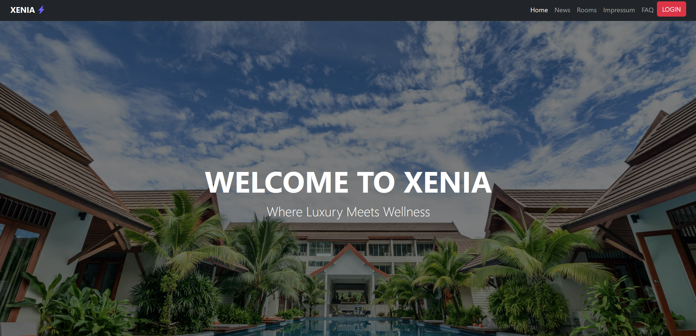
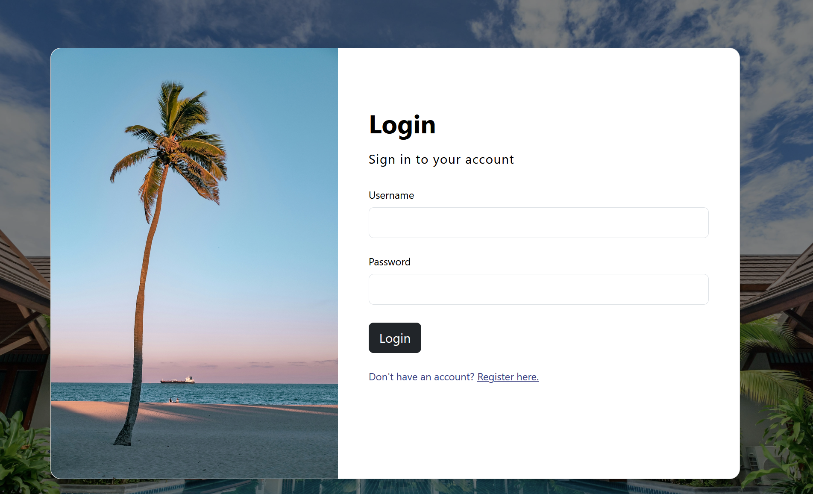
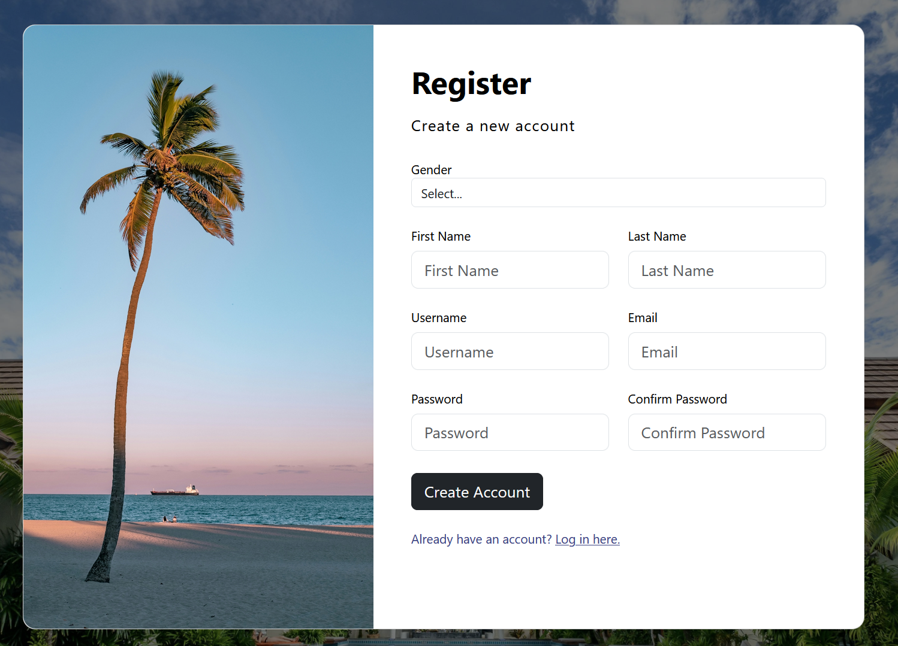
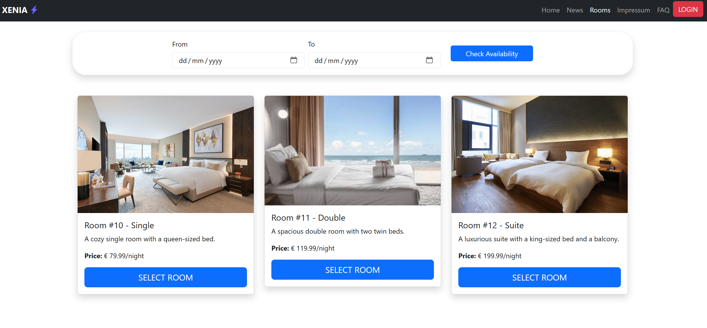
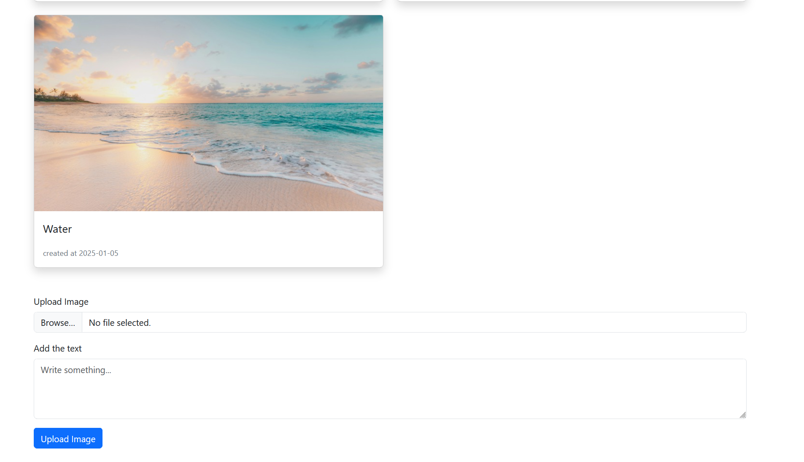
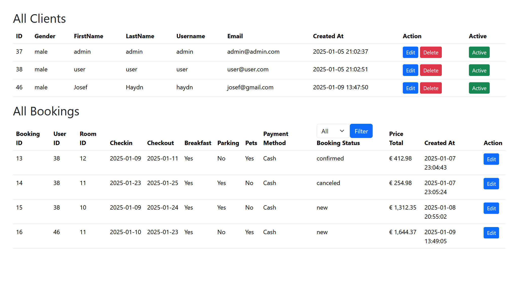

# 🏨 Hotel Website - Semester Project  

Built by **Ensar** and **Marcel**  

A fully functional hotel website featuring user authentication, room reservations, and news post management.  

## 🚀 Technologies Used  
- **Frontend:** HTML, CSS  
- **Backend:** PHP  
- **Database:** MySQL  

## ✨ Features  
✅ User authentication (Login & Register)  
✅ Room reservation system  
✅ News posting functionality  

## 📸 Screenshots  

  
  
  
  
  

## 📦 Installation  
1. Clone the repository:  
   ```sh  
   git clone https://github.com/ItisMaci/Hotel-Website.git
   ```  
2. Import the database `dbacess.sql`  into MySQL  
3. Configure database connection in `dbaccess.php`  
4. Run the project on a local server (e.g., XAMPP)
